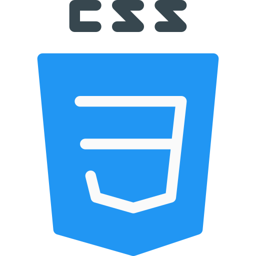

<h1 align="center">Recreating the Google homepage</h1>

  <a href="https://google.com">
    Google Homepage
  </a>UI clone for study purposes.

  

  

<h3 align="center">
  Participants
</h3> 

  

  <a href="https://github.com/CaioLemec">
    GitHub
  </a>

<h3 align="center">
  Tecnology
</h3> 

  
  

<h3 align="center">
  Resources
</h3> 

<li align="center">HTML & CSS</li>
<li align="center">SVG Images</li>
<li align="center">Assets by 
  <a href="https://rocketseat.com.br/">
    Rocketseat
  </a>
</li>

<h3 align="center">
  Start Dev Environment for VSCode
</h3> 

<blockquote>
1. Open project folder in VSCode.  
2. Install Live Server extension.   
3. Right click index.html then Open with Live Server.  
4. Access the generated address in your browser.  
<blockquote>

